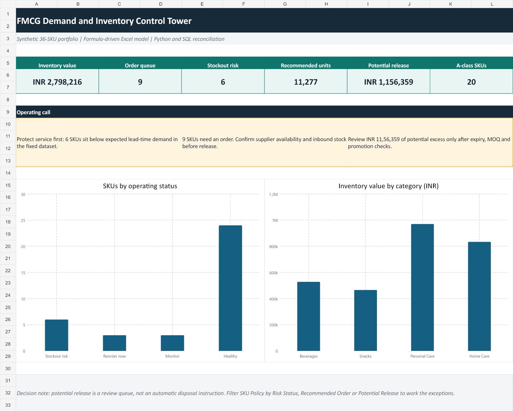

# FMCG demand and inventory control tower

I built this case to answer an operations question that a dashboard alone cannot solve: which SKUs need attention today, how much should be ordered, and where is working capital sitting without protecting service?

> **Data note:** the company, SKUs and operating history are synthetic. The inventory logic is real and fully inspectable. This repository does not represent a client or employer dataset.

## The short version

**Problem:** one replenishment rule treats a steady, high-value SKU the same as a low-value, volatile one.

**What I built:** a 24-month, 36-SKU control tower using Excel, Python and SQL. It combines ABC value segmentation with XYZ demand variability, then calculates safety stock, reorder point, EOQ, risk status, recommended order quantity and potential working-capital release.

**Start here:** download the [Excel control tower](excel/fmcg-inventory-control-tower.xlsx) or open the [case study](CASE_STUDY.md).



## Files

| Area | What is included |
|---|---|
| Excel | Formula-driven control tower, SKU policy table, ABC-XYZ matrix, demand history, parameters and data notes |
| Python | Deterministic synthetic data generation plus an independent policy calculation |
| SQL | Reorder queue, stockout exposure, working-capital release and service-risk queries |
| Data | SKU master and 24 months of monthly demand |
| QA | Python policy snapshot and compact summary for reconciliation |

## Operating logic

- **ABC** ranks SKUs by annual consumption value. A covers the first 80%, B the next 15%, and C the remainder.
- **XYZ** separates stable, moderate and volatile demand using coefficient of variation.
- **Safety stock** uses demand variability, lead time and a class-based service factor.
- **Reorder point** equals lead-time demand plus safety stock.
- **Recommended order** is triggered only when inventory position reaches the reorder point.
- **Potential release** flags stock beyond one EOQ cycle plus safety stock. It is a review queue, not an instruction to liquidate inventory.

## Reproduce it

```bash
python scripts/generate_and_analyze.py
```

The workbook remains editable. Change service factors, ABC thresholds, holding rate, lead time, current stock or order cost and the operating outputs update through formulas.

## Method sources

- Microsoft, ABC analysis report concept: https://learn.microsoft.com/en-us/dynamics365/business-central/reports/report-723
- Open-access safety-stock case comparing service-level and ABC-XYZ approaches: https://www.mdpi.com/2079-8954/12/7/260
- Oracle inventory guide for reorder-point planning: https://docs.oracle.com/cd/B15436_02/current/acrobat/115invug.pdf

## Limits

The model assumes monthly demand variability can approximate lead-time risk. It does not model supplier reliability, minimum order quantities, shelf life, promotions, capacity, substitution or multi-echelon inventory. Z-class demand may need an intermittent-demand method before production use.
